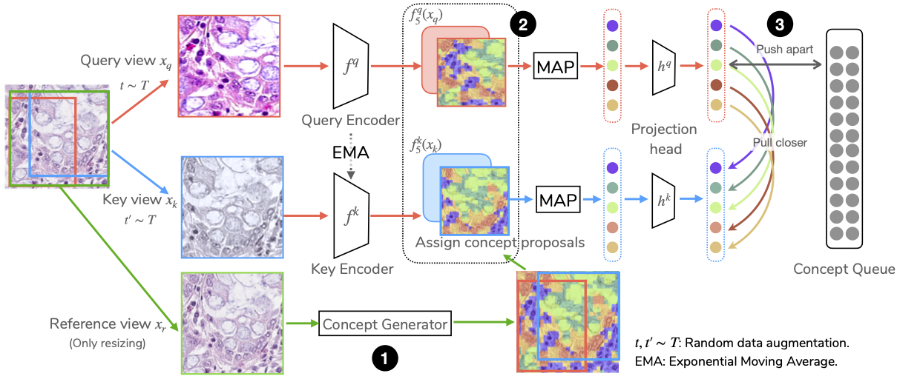

# ConCL: Concept Contrastive Learning for Dense Prediction Pre-training in Pathology Image

This project hosts the code for ConCL, a self-supervised algorithm for dense prediction pre-training in pathology images.

## Installation
----

Please refer to [INSTALL.md](docs/INSTALL.md) for installation and dataset preparation.

## Getting Started
---

Please see [GETTING_STARTED.md](docs/GETTING_STARTED.md) for the basic usage of OpenSelfSup.

## Models
---
pre-train method | backbone | # pre-training epoch | GlaS AP_bb | CRAG AP_bb 
--- |:---:|:---:|:---:|:---:|
SimCLR    | ResNet-18 | 200 | 50.7 | 49.2 
BYOL      | ResNet-18 | 200 | 50.9 | 49.9 
PCL-v2    | ResNet-18 | 200 | 49.4 | 51.0 
MoCo-v1   | ResNet-18 | 200 | 50.0 | 47.2 
MoCO-v2   | ResNet-18 | 200 | 52.3 | 50.0 
DenseCL   | ResNet-18 | 200 | 53.9 | 52.3 
ConCL     | ResNet-18 | 200 | 56.8 | 55.4 
SimCLR    | ResNet-18 | 400 | 51.6 | 48.9 
BYOL      | ResNet-18 | 400 | 50.8 | 50.3 
MoCo-v1   | ResNet-18 | 400 | 50.6 | 46.7 
MoCO-v2   | ResNet-18 | 400 | 54.6 | 51.7 
DenseCL   | ResNet-18 | 400 | 55.1 | 52.9 
ConCL     | ResNet-18 | 400 | 58.2 | 54.7 
SimCLR    | ResNet-18 | 800 | 50.6 | 48.1 
BYOL      | ResNet-18 | 800 | 50.2 | 49.3 
MoCo-v1   | ResNet-18 | 800 | 49.8 | 47.2 
MoCO-v2   | ResNet-18 | 800 | 55.2 | 51.8 
DenseCL   | ResNet-18 | 800 | 56.0 | 52.5 
ConCL     | ResNet-18 | 800 | 58.6 | 55.0 

The pre-trained models are available at this [link](https://drive.google.com/drive/folders/1bNUs5g_eK3mg4YnfdabqKkg-BzkVp612?usp=sharing).

## Usage
---

### Training
    bash tools/dist_train.sh configs/NCT_pretraining/concl/r18_bs256_ep200.py 8

### Extracting Backbone Weights
    WORK_DIR=work_dirs/NCT_pretraining/concl/r18_bs256_ep200/
    CHECKPOINT=${WORK_DIR}/epoch_200.pth
    WEIGHT_FILE=${WORK_DIR}/concl_r18_bs256_ep200.pth
    
    python tools/extract_backbone_weights.py ${CHECKPOINT} ${WEIGHT_FILE}

### Transferring to Object Detection and Instance Segmentation
Please refer to [detection/README.md](benchmarks/detection/README.md) for transferring to dense prediction tasks in GlaS and CRAG dataset.

An example overall script is provided as below:

    project_root=$PROJECT_ROOT

    cd $project_root

    model=concl
    config=r18_bs256_ep200
    epoch=200

    conda activate open-mmlab

    mkdir work_dirs/pretrained_models

    python tools/extract_backbone_weights.py  \
        work_dirs/NCT_pretraining/$model/$config/epoch_$epoch.pth \
        work_dirs/pretrained_models/$model/$config.pth

    conda activate detectron2

    cd benchmarks/detection

    mkdir -p work_dirs/converted_weights

    python convert-pretrain-to-detectron2.py \
        ../../work_dirs/wsi_pretrains/$model/$config.pth    \
        work_dirs/converted_weights/$model/$config.pkl

    # 5 independent runs of fine-tuning.
    for i in {1..5}
    do 
        bash run.sh configs/GlaS/GlaS_R_18_FPN_1x_moco.yaml \
            work_dirs/converted_weights/$model/$config.pkl  \
            8  \
            work_dirs/wsi_submission/GlaS/$model/$config/GlaS_R_18_FPN_1x_moco/$i
    done

    # 5 independent runs of fine-tuning.
    for i in {1..5}
    do 
        bash run.sh configs/CRAG/CRAG_R_18_FPN_1x_moco.yaml \
            work_dirs/converted_weights/$model/$config.pkl  \
            8  \
            work_dirs/wsi_submission/GlaS/$model/$config/CRAG_R_18_FPN_1x_moco/$i
    done

## Acknowledgement

- We would like to thank the [OpenSelfSup](https://github.com/open-mmlab/OpenSelfSup) for its open-source project.
- We would like to thank the [SCRL](https://github.com/kakaobrain/scrl) for the implementation of views' transformation parameters reserving.
